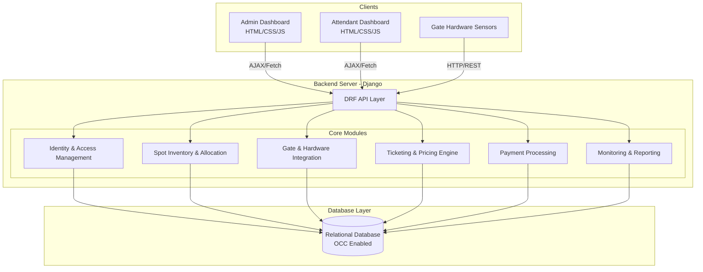
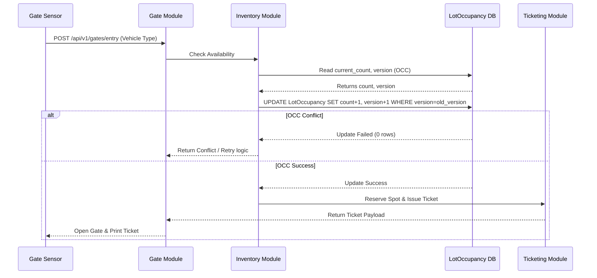
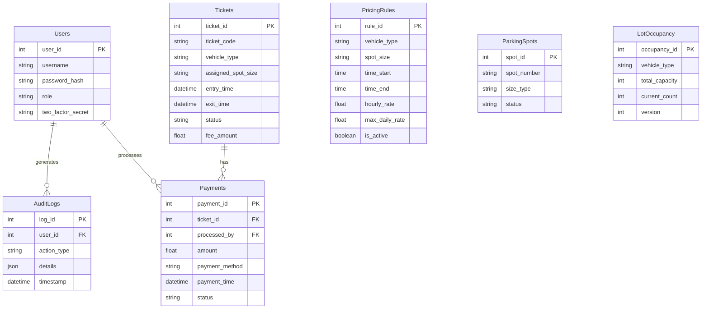

# Architectural Pattern Recognition: Parking Lot Management System

Based on the provided `prd.md` and `system_design.md` documents, the system architecture can be recognized as a **Modular Monolith** employing an **API-First Client-Server** pattern with **Optimistic Concurrency Control (OCC)** for data integrity.

## 1. Identified Architectural Patterns

1. **Modular Monolith**: The backend is logically divided into self-contained core modules (IAM, Spot Inventory, Gate & Hardware, Ticketing & Pricing, Payment, and Monitoring). They share a single relational database but maintain distinct boundaries, ensuring separation of concerns while keeping operations within a single application scope for simplicity and ease of deployment.
2. **API-First (Backend-for-Frontend)**: The Django backend acts as an API provider (via Django REST Framework) serving structured JSON payloads. The UI relies on lightweight decoupled asynchronous JavaScript (AJAX/Fetch) polling against these REST APIs, shifting from the traditional Django MTV (Model-Template-View) pattern into a more modern SPA-like interactive interface.
3. **Optimistic Concurrency Control (OCC)**: Built directly into the data tier (specifically the `LotOccupancy` table) to safely and efficiently process rapid, concurrent hardware events (such as multiple cars arriving at gates simultaneously) without aggressive database locking, minimizing race conditions natively.

## 2. System Architecture (Container Diagram)

## 3. Core Module Interactions & OCC Flow

This diagram showcases the optimistic concurrency flow during a spot logic check, reinforcing the scalable transactional patterns utilized by the inventory module.

## 4. Database Entity-Relationship Diagram (ERD)

