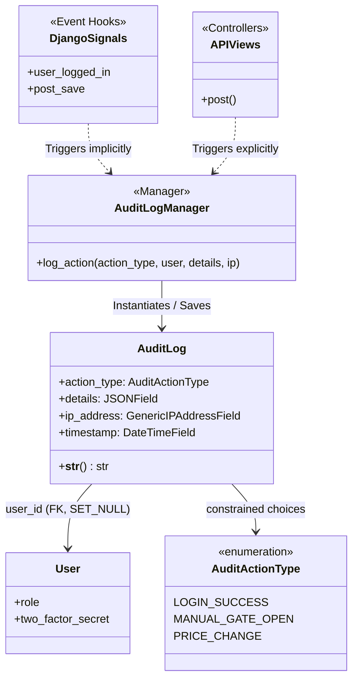

# AuditLog Class Analysis

Based on the system requirements defined in the PRD, System Design, and Track 1 implementation records, the `AuditLog` class is a foundational component of the Identity & Access Management (IAM) module. Below is a detailed analysis of its function, collaborations, and architectural execution.

## 1. Primary Function

The core responsibility of the `AuditLog` class is to act as an **immutable, append-only security ledger**. 

As strictly dictated by **PRD §4.2 (Security & Access)**, every sensitive action within the system must be permanently logged and tied to the initiating user. The `AuditLog` achieves this by preserving the "Who, What, When, Where, and How" of critical events:
* **Who:** Tracked via a foreign key to the invoking user.
* **What:** Formalized via strict semantic action types (e.g., Gate Overrides, Pricing Modifications).
* **When:** Auto-recorded via an indexed DateTime field.
* **Where:** Extracting the source IP address when applicable.
* **How:** Utilizing a flexible JSON payload (`details`) to store variable before/after states without requiring constant schema migrations.

Functionally, it satisfies the non-functional requirement for strict auditing of both administrative back-office duties and system-level events (like failed logins).

---

## 2. Class Data and Function Members

To securely track the items listed above, the `AuditLog` class explicitly defines the following data models and object-level methods.

### 2.1 Data Members (Attributes)

| Data Member | Type | Purpose & Meaning |
| :--- | :--- | :--- |
| `user` | `ForeignKey (User)` | Identifies the specific staff member (Admin or Attendant) who initiated the action. If the action was taken by the system autonomously (e.g., failed login via an unauthenticated user), this is set to `NULL`. Uses `on_delete=models.SET_NULL` to ensure the audit log isn't deleted if the user account is removed. |
| `action_type` | `CharField` | A semantic label categorizing the event. It maps to the `AuditActionType` enumeration (e.g., `MANUAL_GATE_OPEN`, `PRICE_CHANGE`). It is highly indexed (`db_index=True`) to allow the back-office dashboard to quickly filter logs by event type. |
| `details` | `JSONField` | An arbitrary payload dictionary providing context about the action. Rather than creating a unique table for every kind of audit event, this JSON dictionary dynamically holds variables such as the "old hourly rate" and "new hourly rate" during a price change. |
| `ip_address` | `GenericIPAddressField` | The source IPv4 or IPv6 tracking footprint of the HTTP request that triggered the action. Capturing this allows security audits to trace geographical/network origins of suspicious behavior. |
| `timestamp` | `DateTimeField` | Automatically records the exact UTC system time the record was created (`auto_now_add=True`). It is indexed (`db_index=True`) natively so the system can rapidly perform ORDER BY sorts and date-range queries on the dashboard. |
| `objects` | `AuditLogManager` | The default Django database manager has been explicitly swapped out for a custom `AuditLogManager`. This custom manager intercepts the logging instructions to enforce append-only security semantics. |

### 2.2 Function Members (Methods)

| Function/Method Member | Purpose & Meaning |
| :--- | :--- |
| `__str__(self) -> str` | The standard human-readable string representation of the model instance. Returns a formatted sentence denoting the timestamp, the user (or "system"), and the action type (e.g., `[2026-04-08 10:24:01] admin — PRICE_CHANGE`). Used primarily in the Django Admin panel and terminal outputs for clarity. |

*(Note: Standard data manipulation methods like `save()` or `delete()` are purposely left unwritten or overridden by the overarching system logic via the manager to maintain the strict property that Audit logs cannot be edited once saved. Developers interact exclusively with the `AuditLogManager.log_action()` function wrapper.)*

---

## 3. Collaborating Classes

To fulfill the auditing requirements securely and transparently, `AuditLog` relies on several collaborating components:

### A. The `User` Model
* **The Collaboration:** `AuditLog` maintains a foreign key back to the `accounts.User` model.
* **Significance:** This establishes the "Who". Crucially, the foreign key uses `on_delete=models.SET_NULL`. This guarantees that if an admin or attendant account is deleted (e.g., staff member terminates employment), their historical audit trail remains in the database perfectly intact (with `user=NULL`), satisfying strict compliance persistence rules.

### B. The `AuditLogManager` Class (`objects`)
* **The Collaboration:** The Django `models.Manager` is overridden by a custom `AuditLogManager`.
* **Significance:** It serves as the exclusive gateway for creating log entries. It exposes a single, strongly-typed `log_action()` method with enforced keyword-arguments. By routing all event creation through this manager, the application architecturally guarantees "append-only" semantics, ensuring existing logs cannot be structurally overwritten.

### C. The `AuditActionType` Class
* **The Collaboration:** An enumeration (`models.TextChoices`) tightly coupled to the `action_type` field.
* **Significance:** It defines the exact taxonomy of system events (e.g., `MANUAL_GATE_OPEN`, `PRICE_CHANGE`, `LOGIN_FAILED`). This prevents "magic strings" in the codebase and allows the Admin Dashboard to confidently sort and filter events via exact matches.

### D. Django Signal Dispatchers
* **The Collaboration:** Built-in `django.contrib.auth` signals (`user_logged_in`, `user_login_failed`) and `django.db.models` signals (`post_save`).
* **Significance:** Event-driven logging. This isolates logging concerns from core business logic (a pattern known as aspect-oriented programming). For example, when a user is created, a `post_save` signal catches the event and triggers `AuditLogManager.log_action()` silently in the background.

---

## 4. How it is Achieved (UML Diagrams)

### Collaboration Class Diagram
This diagram outlines the structural relationships and how dependencies flow from peripheral systems into the `AuditLog` database table.

### Event Execution Sequence (Data Flow)
The system captures events via two primary streams: **Implicitly via Signals** (e.g., log-in events) and **Explicitly via Views** (e.g., manual business state modifications like activating 2FA). 

The following Sequence Diagram illustrates the flow when a user successfully authenticates, triggering implicit logging.

```mermaid
sequenceDiagram
    autonumber
    participant Client as Frontend / User
    participant AuthView as LoginView
    participant Framework as Django Auth
    participant Signals as accounts/signals.py
    participant Manager as AuditLogManager
    participant DB as SQLite / MySQL (accounts_audit_logs)
    
    Client->>AuthView: POST /api/v1/auth/login/ (Credentials)
    AuthView->>Framework: Validate Username & Password
    
    alt Credentials Valid
        Framework-->>Signals: Broadcast `user_logged_in` signal
        activate Signals
        
        Signals->>Signals: Extract Client IP from Headers
        Signals->>Manager: log_action(type="LOGIN_SUCCESS", user, ip)
        activate Manager
        
        Manager->>Manager: Instantiate AuditLog model object (Populates Data Members)
        Manager->>DB: INSERT INTO accounts_audit_logs (append-only write)
        DB-->>Manager: Confirm write
        
        Manager-->>Signals: Return saved instance
        deactivate Manager
        
        Signals-->>Framework: Signal processing complete
        deactivate Signals
        
        Framework-->>AuthView: Authentication complete
        AuthView-->>Client: HTTP 200 OK (Returns JWT)
    else Credentials Invalid
        Framework-->>Signals: Broadcast `user_login_failed` signal
        Note right of Signals: Exact same pipeline as above,<br/>but with user=NULL and type=LOGIN_FAILED
    end
```

### Execution Strategy Summary
1. **Schema design**: `AuditLog` leverages a `JSONField` allowing developers to push any arbitrary dictionary of "old" and "new" values directly into the DB without altering schemas.
2. **Performance Constraints**: Highly-targeted database indexes such as `idx_audit_user_timestamp` (combining User and inverse Timestamp fields) verify that querying the audit trail on the Admin Dashboard remains `O(log N)` instantaneous regardless of how large the ledger grows.
3. **Immutability Assurance**: Neither the `AuditLog` model nor the API endpoints provide an `update` or `delete` functionality. The system enforces append-only semantics by design.
