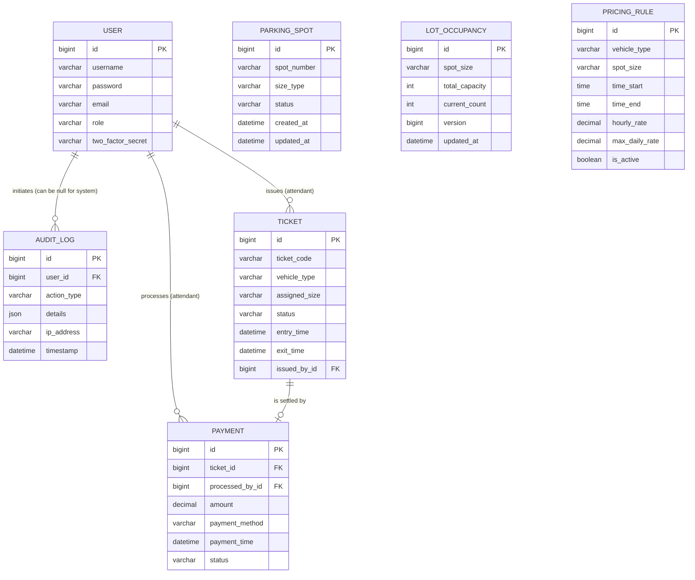

# Database Entity-Relationship Diagram

This diagram maps out the relationships between all tables in the Parking Lot Management System, highlighting the Primary Keys (PK) and Foreign Keys (FK).

### Relationship Breakdown:
* **`USER` to `AUDIT_LOG` (1-to-Many):** One user can generate many audit logs. A log's foreign key (`user_id`) points to the User who initiated the action.
* **`USER` to `TICKET` (1-to-Many):** One user (an attendant) can issue many tickets.
* **`USER` to `PAYMENT` (1-to-Many):** One user (an attendant) can process multiple payments.
* **`TICKET` to `PAYMENT` (1-to-1/Many):** A ticket is settled by a payment. The payment holds the foreign key (`ticket_id`) linking back to the ticket. 

*(Note: `ParkingSpot`, `LotOccupancy`, and `PricingRule` do not have direct foreign key relationships in the database, as they are independently queried configuration or physical inventory tables.)*
